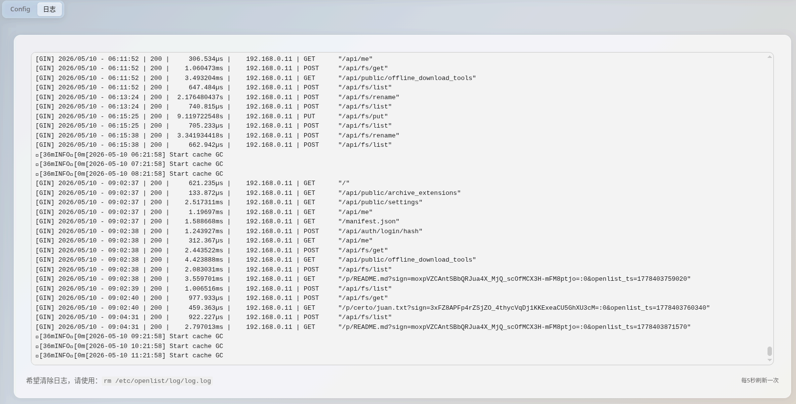

# luci-app-oplist
- LuCI support for OpenList
## 文/A
- Supported Simplified Chinese and English
## 🚀 Features
- The musl binary file of OpenList is packaged, bypassing the older binary with OpenWrt.
- Support setting TLS, log storage location, etc. for OpenList in LuCI.
## UI Screenshot

## ⚠️ Compatibility
- It only supports ImmortalWrt 25.12.0-rc2 or later.
- It is not guaranteed that it can be used on non-x86_64(amd64) and non-aarch64(arm64) architectures.
## 🛠 How to build?
[Generic Docs](https://867678.xyz/doc-build)
## ⚖️ License
> We have included the OpenList binary, which is developed by OpenListTeam and based on the AGPL-3.0 open source.
>
> The log shows a partial quote: <https://github.com/Internet1235/luci-app-openlist/blob/main/luci-app-openlist/htdocs/luci-static/resources/view/openlist/log.js> With Apache-2.0 License
> 
> This application provides **no warranties.**
